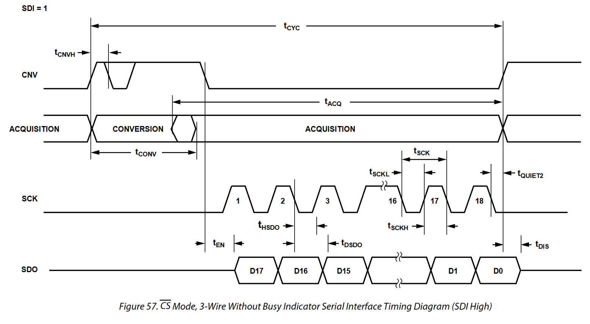
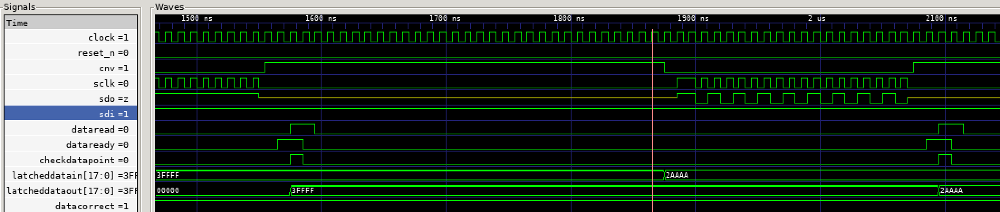

# ADCinputAD4007

This file documents the function of the *vhdl* block ADCinputAD4007.
Full details about the part can be found in the data sheet at [https://www.analog.com/media/en/technical-documentation/data-sheets/AD4003-4007-4011.pdf](https://www.analog.com/media/en/technical-documentation/data-sheets/AD4003-4007-4011.pdf).
The block is designed to drive the ADC in 3 wire cs_n turbo mode. Control of the
sample rate between 2MHz and 0.5MHz is provided.



The timing is driven by an FSM:


## Doxygen
The code is written to generate a useful doxygen output including graphs for the FSMs.

## Input requirements
The block should be provided with a 100Mhz clock which has better then 0.45 mark
space ration. The reset should be synchronous to this clock.

## Output signals
The block outputs the data to a 18 bit vector which is valid when the dataValid_o
signal is high. dataValid is set low when the dataRead_i is high.


This is driven by the FSM.


## Sample Rates
The ADC is designed to be run at 2MHz however flexibility is provided with 32
steps allowing for the following range of sample rates.

| Setting | Sample Rate | Sample Time |
|---------|-------------|-------------|
| 0       | 2.000       | 5.00E-07    |
| 1       | 1.852       | 5.40E-07    |
| 2       | 1.724       | 5.80E-07    |
| 3       | 1.613       | 6.20E-07    |
| 4       | 1.515       | 6.60E-07    |
| 5       | 1.429       | 7.00E-07    |
| 6       | 1.351       | 7.40E-07    |
| 7       | 1.282       | 7.80E-07    |
| 8       | 1.220       | 8.20E-07    |
| 9       | 1.163       | 8.60E-07    |
| 10      | 1.111       | 9.00E-07    |
| 11      | 1.064       | 9.40E-07    |
| 12      | 1.020       | 9.80E-07    |
| 13      | 0.980       | 1.02E-06    |
| 14      | 0.943       | 1.06E-06    |
| 15      | 0.909       | 1.10E-06    |
| 16      | 0.877       | 1.14E-06    |
| 17      | 0.847       | 1.18E-06    |
| 18      | 0.820       | 1.22E-06    |
| 19      | 0.794       | 1.26E-06    |
| 20      | 0.769       | 1.30E-06    |
| 21      | 0.746       | 1.34E-06    |
| 22      | 0.725       | 1.38E-06    |
| 23      | 0.704       | 1.42E-06    |
| 24      | 0.685       | 1.46E-06    |
| 25      | 0.667       | 1.50E-06    |
| 26      | 0.649       | 1.54E-06    |
| 27      | 0.633       | 1.58E-06    |
| 28      | 0.617       | 1.62E-06    |
| 29      | 0.602       | 1.66E-06    |
| 30      | 0.588       | 1.70E-06    |
| 31      | 0.575       | 1.74E-06    |

The formula is:
$$1/((1/2MHz) + (1/(setting * 10ns) * 4))$$


## Simulation
The test bench attaches two units the main *ADCinputAD4007* block and an
version of the AD4007 ADC. A buffer between the two in the 'SDO' line is also
modelled.

Data is passed into the virtual AD4007 from the testbench this the clocks the
data out over a serial interface as per the AD4007 data sheet. The FPGA side
module then receives this and the test bench collects it to verify the data
against the send date.

Initially a set of bit patterns for debugging are transmitted. Following this
random values are transmitted. The values are logged and checked against
coverage bins to ensure good coverage of the edge conditions.

The results are then listed in an OSVVM scoreboard.

### Running simulations
The simulations can be run in GHDL and also Active-HDL. Both require OSVVM.


### Simulation Output
The timing can be verified against the part data sheet using the waveform viewer:



The *OSVVM* output can also be checked from the file *./AD4007_data_test.txt*:

```
%% WriteBin:
%% ADC close to 0 positive  Bin:(0 to 20)   Count = 2  AtLeast = 1
%% ADC close to 0 negative  Bin:(262123 to 262143)   Count = 4  AtLeast = 1
%% ADC positive  Bin:(131052 to 131071)   Count = 2  AtLeast = 1
%% ADC negative  Bin:(131073 to 131094)   Count = 1  AtLeast = 1

%% Log   INFO    Reached end of test at 11412235 ns
%% DONE  PASSED  AD4007 test  at 11412235 ns
%% Alert FAILURE End of Test at 11412235 ns

%% Alert Stop Count on FAILURE reached at 11412235 ns
%% DONE  FAILED  AlertLogTop  Total Error(s) = 1  Failures: 1  Errors: 0  Warnings: 0  at 11412235 ns
RUNTIME: Info: RUNTIME_0141 AlertLogPkg.vhd (673): stop called.
```
